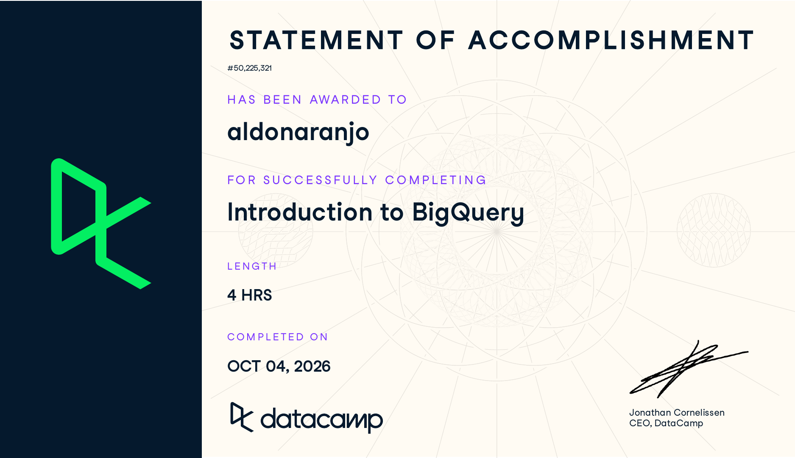

# Course-Completion Evidence



I completed the Introduction to BigQuery course through the IBM 6500 DataCamp classroom on October 4, 2026. The course is listed at four hours and covers BigQuery architecture, query writing and data types, querying techniques, and data management and optimization.

# Learning Notes and Key Takeaways

## Chapter 1: BigQuery Architecture and Structure

**Main ideas.** This chapter was about what actually makes BigQuery different from the SQL databases I worked with in the previous course. The biggest difference is how computation happens. In a traditional database, storage and compute live together on the same server, so the size of that server sets a hard ceiling on what you can query. BigQuery splits them apart. Data sits in storage, and the processing power that runs a query gets allocated on demand and released when the query finishes. That is what makes it serverless from the user's side: there is no machine to size, start, or maintain.

The other structural difference is that BigQuery stores data by column rather than by row. If a table has forty columns and my query only names two of them, it only reads those two. That one detail explains a lot of the behavior I ran into later in the course, including why writing `SELECT *` is discouraged.

**BigQuery terminology and procedures.** The data organization follows a three level hierarchy. A **project** is the top container and handles billing and permissions. A **dataset** sits inside a project and groups related tables, and it also sets the geographic location where data lives. A **table** holds the actual rows. Because of that hierarchy, every table reference needs all three parts.

Other terms worth keeping: **slots** are the units of compute BigQuery assigns to a query, **schema** is the definition of each column and its data type, and **columnar storage** is the storage model described above.

**Important syntax.** Fully qualified table names are written in backticks with three parts separated by periods.

```sql
SELECT customer_id, order_total
FROM `project_id.dataset_name.orders`;
```

Here `project_id` is the Google Cloud project that owns the data, `dataset_name` is the container grouping related tables, and `orders` is the table being queried.

**Explanation.** The backtick syntax is required because the dots would otherwise be ambiguous. Naming the two columns rather than using `SELECT *` means BigQuery only scans those two columns, which is both faster and cheaper.

**CEP application.** For the Collins College enrollment and retention project, the project and dataset structure is how I would keep sources separate but queryable together. Website behavior data, survey responses, and enrollment records could each live in their own dataset inside one project, which keeps permissions manageable while still letting a single query join across them.

## Chapter 2: Writing queries and data types

**Main ideas.** This chapter covered the mechanics of writing queries in BigQuery along with how data gets into it in the first place. Most of the SQL I already knew carried over directly, which was reassuring. What was new was bulk loading and the handling of data types that do not exist in standard SQL.

Loading data can happen a few ways. Batch loading pulls in a file all at once, streaming inserts push rows in continuously for near real time data, and external tables let you query files where they sit without importing them at all. Accepted formats include CSV, newline delimited JSON, Avro, Parquet, and ORC.

**BigQuery terminology and procedures.** BigQuery has four separate date and time types and the distinction matters. **DATE** is a calendar day with no time. **TIME** is a clock time with no date. **DATETIME** carries both but has no timezone attached. **TIMESTAMP** is an absolute point in time anchored to UTC.

The part that was genuinely new to me was unstructured and nested data. A single column in BigQuery can hold an **ARRAY**, which is an ordered list of values, and a **STRUCT**, which holds named subfields the way a small record would. To query the contents of an array you have to flatten it into rows first, which is what **UNNEST** does.

**Important syntax.** Formatting dates for reporting:

```sql
SELECT
  order_id,
  FORMAT_DATE('%Y-%m', order_date) AS order_month,
  order_total
FROM `project_id.dataset_name.orders`
WHERE order_date BETWEEN '2026-01-01' AND '2026-06-30';
```

Flattening an array column so its values become rows:

```sql
SELECT
  order_id,
  item
FROM `project_id.dataset_name.orders`,
UNNEST(item_list) AS item;
```

**Explanation.** The first query turns a full date into a year and month string so results group cleanly by reporting period, then limits the scan to the first half of the year. The second takes `item_list`, a column where each row holds several items, and produces one row per item so the individual values can be filtered and counted.

**CEP application.** Both of these map onto work I already do. Formatting dates into reporting periods is what every monthly client report needs. UNNEST matters because GA4 exports into BigQuery with heavily nested event data, so if the CEP involves analyzing site behavior for the Collins College audience, flattening arrays is the first step before anything useful comes out.

## Chapter 3: Querying data in BigQuery

**Main ideas.** This chapter went past basic SELECT statements into the functions that make analysis practical on large tables. The part that changed how I think about queries was window functions, which calculate across a set of related rows without collapsing them into a single result the way GROUP BY does. That means you can show each individual row and its rank, or each row and how it compares to the previous one, in the same output.

**BigQuery terminology and procedures.** A **common table expression**, written with WITH, defines a named temporary result that the rest of the query can reference. It makes multi step logic readable rather than nesting subqueries inside each other.

On the aggregation side, **COUNTIF** counts rows meeting a condition without needing a CASE WHEN wrapper, which is cleaner than how I would have written it before. **HAVING** filters after grouping, as opposed to WHERE which filters before, so HAVING is what you use to filter on an aggregate result. **ANY_VALUE** returns an arbitrary value from a group, which is useful when a field is the same across every row in the group and adding it to GROUP BY would be unnecessary noise.

Window functions include **RANK** for ordering rows, and **LEAD** and **LAG** for reaching forward or backward to another row, which is how period over period comparisons get built. **QUALIFY** filters on the result of a window function directly, something standard SQL cannot do without wrapping the whole query in a subquery.

**Important syntax.**

```sql
WITH customer_totals AS (
  SELECT
    customer_id,
    SUM(order_total) AS total_spend,
    COUNTIF(order_total > 100) AS large_orders
  FROM `project_id.dataset_name.orders`
  GROUP BY customer_id
  HAVING total_spend > 500
)
SELECT
  customer_id,
  total_spend,
  large_orders,
  RANK() OVER (ORDER BY total_spend DESC) AS spend_rank
FROM customer_totals
QUALIFY spend_rank <= 10;
```

**Explanation.** The CTE builds a per customer summary, counting how many of their orders exceeded one hundred dollars and keeping only customers who spent more than five hundred total. The outer query then ranks those customers by spend and QUALIFY cuts the result to the top ten. Without QUALIFY this would need another layer of subquery, since you cannot put a window function in a WHERE clause.

**CEP application.** Ranking and period comparison is most of what client reporting consists of. LAG in particular would let me calculate month over month change directly in the query instead of exporting to a spreadsheet and doing it by hand, which is how I handle it now. For the CEP, ranking which channels or content drive the most engagement among prospective students is the same pattern.

## Chapter 4: Data management and optimization

**Main ideas.** The last chapter pulled together joins, the statements that change data rather than read it, and the practices that keep queries from getting expensive. Choosing the right join type was the part I spent the most time on, since the difference between them determines which rows survive and it is easy to lose data without noticing.

**BigQuery terminology and procedures.** The join types work as they do in standard SQL. **INNER JOIN** keeps only rows with a match on both sides. **LEFT JOIN** keeps everything from the left table and fills in nulls where the right has no match, with **RIGHT JOIN** doing the reverse. **FULL OUTER JOIN** keeps unmatched rows from both. **CROSS JOIN** produces every combination of rows, and this is the one that pairs with UNNEST when flattening nested data.

Joins can be combined with aggregations so that the join assembles the full picture and the aggregation summarizes it in the same query.

**Data manipulation language**, or DML, covers the statements that change stored data rather than read it: INSERT adds rows, UPDATE changes values in existing rows, DELETE removes rows, and MERGE handles insert or update in one statement depending on whether a match exists. Worth remembering that BigQuery is built for analytics rather than transactions, so row level changes are slower and more costly here than they would be in a traditional database.

On optimization, the governing idea is that BigQuery bills on bytes scanned, so reducing what a query reads is the same as reducing what it costs. Naming specific columns, filtering on partitioned columns so whole partitions get skipped, and filtering before joining rather than after all cut the amount of data touched.

**Important syntax.** A join combined with aggregation:

```sql
SELECT
  c.customer_region,
  COUNT(DISTINCT o.order_id) AS order_count,
  SUM(o.order_total) AS region_revenue
FROM `project_id.dataset_name.orders` AS o
LEFT JOIN `project_id.dataset_name.customers` AS c
  ON o.customer_id = c.customer_id
WHERE o.order_date >= DATE_SUB(CURRENT_DATE(), INTERVAL 90 DAY)
GROUP BY c.customer_region;
```

A DML statement with a condition:

```sql
UPDATE `project_id.dataset_name.customers`
SET status = 'inactive'
WHERE last_order_date < DATE_SUB(CURRENT_DATE(), INTERVAL 365 DAY);
```

**Explanation.** The first query attaches region information from the customer table onto each order, then rolls the last ninety days up into a count and revenue total per region. The date filter sits in the WHERE clause so it narrows the data before the grouping happens. The second marks customers inactive if they have not ordered in a year, and the WHERE clause is doing the important work here since without it the statement would update every row in the table.

**CEP application.** Joining behavioral data to descriptive data is the shape of most analysis the CEP would need, for instance attaching student or prospect attributes to the actions they took on the site. The optimization habits matter for a different reason, which is that a team sharing a billing project can run up real costs through careless queries, so filtering early is a practical concern rather than just a style preference.

# Overall Reflection and Future Reference

The most useful concepts for me were window functions and the separation of storage and compute. Window functions solved a problem I had been working around manually, since calculating rank or period over period change previously meant exporting results and finishing the job in a spreadsheet. The storage and compute split explained why BigQuery behaves the way it does, including why column selection and filtering affect cost so directly.

Learning BigQuery is different from learning SQL syntax alone because the syntax is only part of what determines whether a query is good. In a standard database a working query is mostly a correct query. In BigQuery a query can be correct and still be wasteful, because what you scan is what you pay for. That adds a dimension I had not been thinking about: not just does this return the right answer, but does it read more data than it needs to.

The most challenging material was the nested data handling, specifically arrays and UNNEST. The idea that a single cell can hold a list of values runs against how I had been picturing a table, and it took working through the exercises before the flattening step made sense. Window function syntax was also awkward at first, since the OVER clause looks unlike anything else in SQL.

For digital marketing analytics the clearest application is GA4, which exports directly into BigQuery with the nested event structure this course covered. That export gives access to raw event level data rather than the pre aggregated reports in the GA4 interface, which means being able to answer questions the standard reports do not. For the Collins College CEP, that would mean being able to look at how prospective students actually move through the site rather than relying on summary metrics alone.

The things I expect to review again are the UNNEST syntax for nested data, the window function patterns particularly LAG for period comparison, and the optimization practices around partitioned columns, since those are the places where getting it wrong has a visible cost.

# Appendix: Publication Links

- [GitHub Repository](https://github.com/naran115/ibm-6500-sql-learning-portfolio)
- [Published Introduction to BigQuery Report](https://naran115.github.io/ibm-6500-sql-learning-portfolio/introduction-to-bigquery.html)
