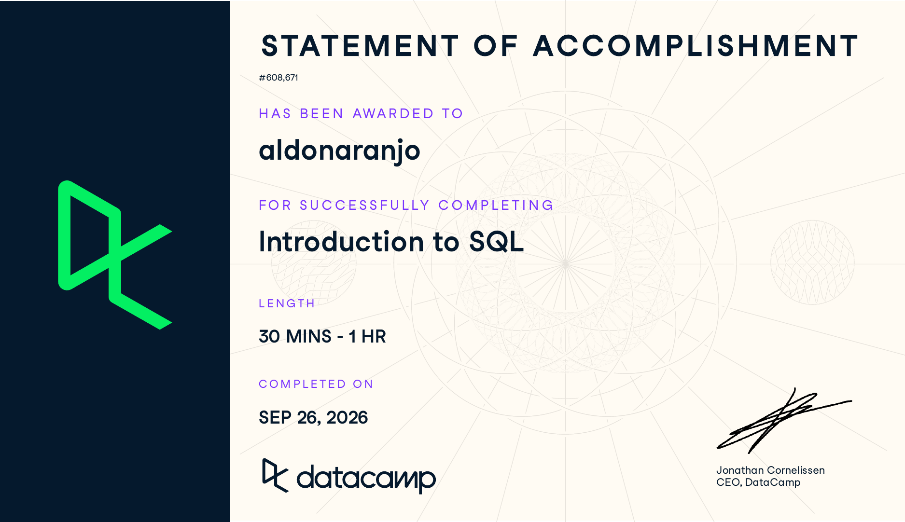

# Course-Completion Evidence

I completed the Introduction to SQL course through the IBM 6500 DataCamp classroom on September 26, 2026. The statement of accomplishment below shows my DataCamp profile name, the course title, and the completion date.

{fig-alt="DataCamp statement of accomplishment awarded to aldonaranjo for completing Introduction to SQL on September 26, 2026" width="90%"}

# Learning Notes and Key Takeaways

The notes below follow the three chapters of the course. To keep the examples close to the kind of data I work with, I use two made up marketing tables throughout: `campaigns` (one row per ad campaign, with columns like `campaign_name`, `channel`, `clicks`, and `cost`) and `leads` (one row per inquiry, with columns like `lead_id`, `source`, and `city`).

## Meet Databases & SQL

**Main ideas.** A database is an organized collection of data stored so a computer can find and return it quickly. A relational database stores that data in tables, and the tables can be linked to each other through shared values, like a `campaign_id` that shows up in both a campaigns table and a leads table. Each table should describe one kind of thing. Every row is a record (one campaign, one lead), and every column is a field that holds one attribute of that record (a name, a date, a cost).

Compared with a spreadsheet, a database can hold far more rows and lets many people work from the same data at once without passing copies around. SQL (Structured Query Language) is the language used to talk to relational databases and pull data out of those tables.

**Important SQL syntax.**

| Term | What it means |
|:--|:--|
| Table | A grid of records and fields about one subject |
| Record (row) | One instance of the subject, such as one campaign |
| Field (column) | One attribute stored for every record |

**Example.**

```sql
SELECT *
FROM campaigns;
```

**Explanation of the example.** This is the simplest possible look at a table. The asterisk means "every column," so the query returns the whole `campaigns` table exactly as it is stored. I would use this first when opening an unfamiliar table, just to see what fields exist and what the values look like before writing anything more specific.

**Marketing and CEP application.** Knowing how tables, records, and fields fit together makes it easier to understand where marketing data actually lives. Ad platform exports, CRM contacts, and call tracking logs are all basically tables. Thinking of them that way helps me plan which fields I need before I start pulling numbers, and it makes it clearer how two sources can connect through a shared value like a campaign ID.

## Write Your First SQL

**Main ideas.** Every query starts with two keywords. `SELECT` names the columns I want back, and `FROM` names the table they come from. I can ask for one column, several columns separated by commas, or all of them with `*`. The order I list the columns in is the order they appear in the results, so I can arrange the output the way I want it to read.

SQL keywords are not case sensitive, but writing them in capital letters and table or column names in lowercase makes queries much easier to scan. A semicolon marks the end of a query. Putting each clause on its own line is not required, but it helps a lot once queries get longer.

`AS` creates an alias, which renames a column in the results only. The table itself does not change. This is useful when the stored column name is short or technical and the result is going to someone else. `DISTINCT` removes duplicate rows so each unique value shows up once, which is the quickest way to see what categories exist in a field.

**Important SQL syntax.**

| Keyword | What it does |
|:--|:--|
| `SELECT` | Chooses which columns to return |
| `FROM` | Names the table to pull from |
| `*` | Shortcut for every column in the table |
| `AS` | Gives a column a temporary name in the results |
| `DISTINCT` | Returns only unique values or unique combinations |
| `;` | Ends the query |

**Example.**

```sql
SELECT campaign_name AS campaign,
       channel,
       clicks
FROM campaigns;
```

```sql
SELECT DISTINCT source
FROM leads;
```

**Explanation of the example.** The first query returns three columns from `campaigns` in the order listed, and relabels `campaign_name` as `campaign` in the output so the result reads more cleanly. The second query looks at the `source` field in `leads` and returns each lead source one time, no matter how many leads came from it. If a thousand leads came from Google Ads, "Google Ads" still appears only once. When `DISTINCT` is used with more than one column, it returns each unique combination of those columns instead.

**Marketing and CEP application.** Selecting only the fields I need is how I would build a clean extract for a report instead of exporting everything and deleting columns later. `DISTINCT` is a fast way to audit data quality. Running it on a source or channel field shows right away if the same channel was entered three different ways ("google", "Google Ads", "GoogleAds"), which would split the numbers in a report if nobody caught it.

## Complete Your SQL Foundation

**Main ideas.** A view is a saved query. Once it is created, it can be queried just like a table, but it does not store its own copy of the data. Every time someone queries a view, the database runs the saved query against the current tables, so the results stay up to date. Views are handy for queries that get reused often, and for giving someone a simplified version of a table with only the fields they need.

The course also covered SQL flavors. SQL is a standard, but different database systems (PostgreSQL, SQL Server, MySQL, and others) each have their own version of it. Most keywords work the same across all of them, and only some details differ from one system to the next.

**Important SQL syntax.**

| Keyword | What it does |
|:--|:--|
| `CREATE VIEW name AS` | Saves a query as a view that can be queried like a table |

**Example.**

```sql
CREATE VIEW paid_search_campaigns AS
SELECT campaign_name, clicks, cost
FROM campaigns
WHERE channel = 'Paid Search';
```

```sql
SELECT campaign_name, clicks
FROM paid_search_campaigns;
```

**Explanation of the example.** The first statement saves a query as a view called `paid_search_campaigns`. The view holds only three columns and only the rows where the channel is Paid Search. The `WHERE` line is the filter that does this; it goes a little beyond this course but makes the point of a view clearer. The second query shows the payoff: I can pull from the view by name, just like a table, without rewriting the filter every time.

**Marketing and CEP application.** A view is a good fit for anything that gets pulled on a regular schedule, like the same monthly set of campaign fields for a client report. Saving it once means everyone pulls from the same definition and the numbers match across reports. Knowing that flavors exist also saves time. When a query copied from an example fails, the first thing to check is whether it was written for a different database than the one I am using.

# Overall Reflection and Future Reference

The most useful skills from this course were the basics I will use in almost every query: `SELECT` and `FROM` to pull specific columns, `AS` to make results readable, and `DISTINCT` to see what values a field actually contains. Views also stood out, because they turn a query I would otherwise rewrite every month into something I can reuse.

Coming into SQL after working in R, the syntax felt easy to pick up. DataCamp's feedback helped too, since it suggested what the input should have been when I got something wrong. Honestly, I still prefer R. SQL flavors reminded me of R packages in a way, where the core language stays the same but each version has its own variations. That was the part I felt least settled on. I am not sure yet how much the differences between flavors will matter once I work in a real database, or whether that will change how I feel about the language. Overall, it was not a bad experience, and it was a solid starting point.

SQL fits naturally into digital marketing analytics because so much marketing data already sits in tables: ad platform results, website sessions, CRM contacts, survey responses, and call logs. Being able to pull exactly the fields I need, check a field for inconsistent labels, and save a standard query as a view would make reporting faster and more consistent. It would also help with survey research, where I could select only the questions and respondent groups that matter for a given analysis.

The things I expect to come back to are the differences between flavors and the exact syntax for creating a view. I also want to revisit how `DISTINCT` behaves across multiple columns, since returning unique combinations is easy to mix up with returning unique values from a single field.

# Appendix: Publication Links {.unnumbered}

- [GitHub Repository](https://github.com/naran115/ibm-6500-sql-learning-portfolio)
- [Published Introduction to SQL Report](https://naran115.github.io/ibm-6500-sql-learning-portfolio/introduction-to-sql.html)
